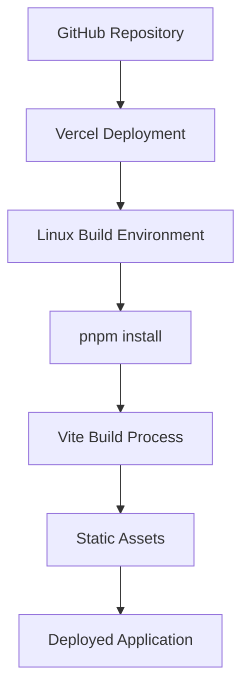

# Design Document

## Overview

The Vercel deployment failure is caused by the presence of `@rollup/rollup-win32-x64-msvc` in the client's devDependencies, which is a Windows-specific package that cannot be installed on Vercel's Linux environment. The solution involves removing platform-specific dependencies, configuring proper build settings for Vercel, and ensuring pnpm compatibility.

## Architecture

The deployment architecture consists of:

1. **Source Code Repository**: GitHub repository containing the full-stack application
2. **Vercel Platform**: Cloud deployment platform running on Linux
3. **Build Process**: Vite-based build system for the React client
4. **Package Management**: pnpm for dependency management



## Components and Interfaces

### 1. Package Configuration
- **Client package.json**: Remove Windows-specific dependencies
- **Root package.json**: Update build scripts to use pnpm consistently
- **pnpm-lock.yaml**: Ensure lockfile compatibility

### 2. Build Configuration
- **Vercel Configuration**: Specify build commands and output directory
- **Vite Configuration**: Ensure cross-platform compatibility
- **Environment Variables**: Configure for production deployment

### 3. Dependency Management
- **Platform-agnostic Dependencies**: Replace or remove OS-specific packages
- **Optional Dependencies**: Use optionalDependencies for platform-specific needs
- **Rollup Configuration**: Use generic rollup packages instead of platform-specific ones

## Data Models

### Build Configuration Model
```typescript
interface BuildConfig {
  buildCommand: string;
  outputDirectory: string;
  installCommand: string;
  nodeVersion: string;
}
```

### Package Dependency Model
```typescript
interface PackageDependency {
  name: string;
  version: string;
  type: 'dependency' | 'devDependency' | 'optionalDependency';
  platform?: 'win32' | 'linux' | 'darwin' | 'cross-platform';
}
```

## Error Handling

### 1. Platform Compatibility Issues
- **Detection**: Identify platform-specific packages during dependency analysis
- **Resolution**: Remove or replace with cross-platform alternatives
- **Prevention**: Add package validation to prevent future platform-specific additions

### 2. Build Failures
- **Rollback Strategy**: Maintain working build configuration in version control
- **Logging**: Enhanced build logs for debugging deployment issues
- **Monitoring**: Track deployment success/failure rates

### 3. Dependency Conflicts
- **Lock File Management**: Ensure pnpm-lock.yaml is committed and up-to-date
- **Version Pinning**: Use exact versions for critical dependencies
- **Conflict Resolution**: Clear dependency resolution strategy

## Testing Strategy

### 1. Local Testing
- **Cross-platform Builds**: Test build process on Windows, Linux, and macOS
- **Package Manager Testing**: Verify builds work with both npm and pnpm
- **Dependency Validation**: Ensure no platform-specific packages remain

### 2. Deployment Testing
- **Staging Environment**: Test deployment on Vercel preview deployments
- **Production Validation**: Verify production builds work correctly
- **Rollback Testing**: Ensure ability to rollback to previous working version

### 3. Automated Testing
- **CI/CD Pipeline**: Add build validation to GitHub Actions
- **Dependency Scanning**: Automated detection of platform-specific packages
- **Deployment Monitoring**: Automated alerts for deployment failures

## Implementation Approach

### Phase 1: Dependency Cleanup
1. Remove `@rollup/rollup-win32-x64-msvc` from devDependencies
2. Update any other platform-specific dependencies
3. Regenerate pnpm-lock.yaml

### Phase 2: Build Configuration
1. Update root package.json build scripts to use pnpm
2. Configure Vercel deployment settings
3. Ensure proper output directory configuration

### Phase 3: Validation and Testing
1. Test local builds on multiple platforms
2. Deploy to Vercel staging environment
3. Validate production deployment

## Security Considerations

- **Dependency Security**: Ensure replacement packages are from trusted sources
- **Build Security**: Validate that build process doesn't introduce vulnerabilities
- **Environment Variables**: Secure handling of any required environment variables

## Performance Considerations

- **Build Time**: Optimize dependency installation and build process
- **Bundle Size**: Ensure dependency changes don't significantly increase bundle size
- **Caching**: Leverage Vercel's build caching for faster deployments